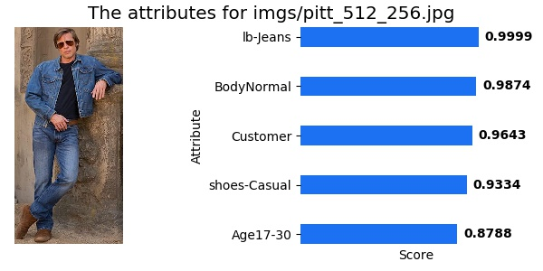
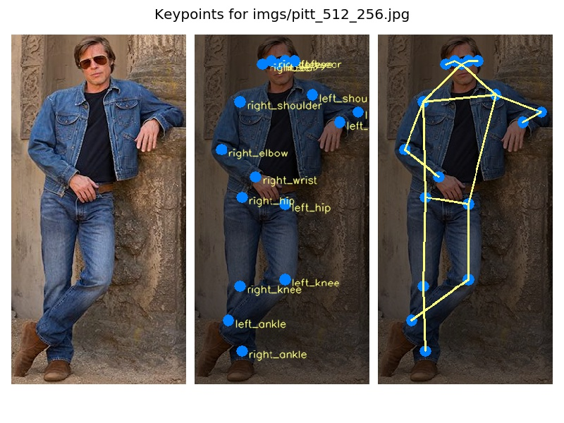
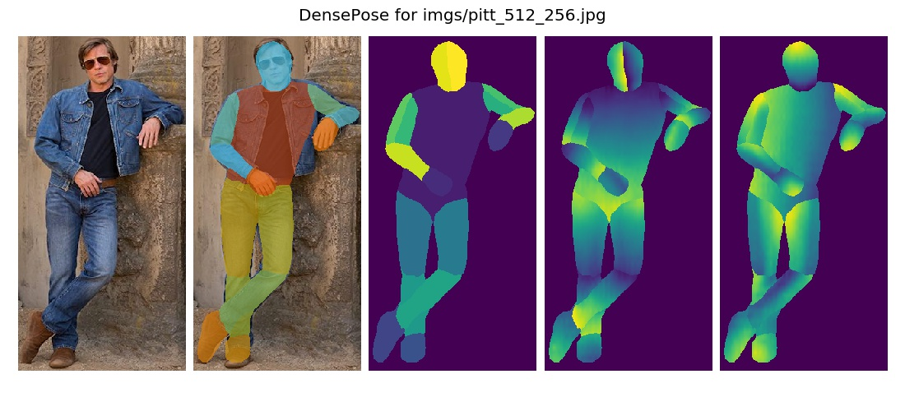
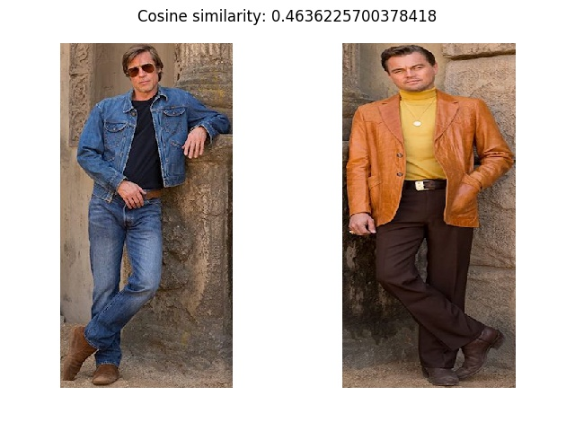

# Visualization

This page includes various examples on visualization.

## Single input

For tasks like classification and pose estimation, which need only one image as input, you should  modify your test image in `imgs/single.json`.

###  Pedestrian Attribute Recognition

To visualize the result of attribute recognition model,

```
python3 launch.py --config configs/attr_deepmar/deepmar_rapv2_r50v1.py --task visualize --image imgs/single.json
```



###  Pose Estimation

To visualize the result of pose estimation model,

```
python3 launch.py --config configs/pose_simple_baseline/simple_pose_r50v1.py --task visualize --image imgs/single.json
```



###  Dense Human Pose Estimation (DensePose)

To visualize the result of densepose model,

```
python3 launch.py --config configs/densepose_baseline/dense_pose_r50v1.py --task visualize --image imgs/single.json
```



## Pair of inputs

For person re-identification, you should input two images. The input setting is formatted in `imgs/pair.json`.

###  Person re-identification

To visualize the result of re-identification model,

```
python3 launch.py --config configs/reid_strong_baseline/strong_baseline_market1501_r50v1_xent_tri_cent.py --task visualize --image imgs/pair.json
```


